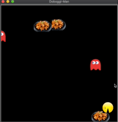
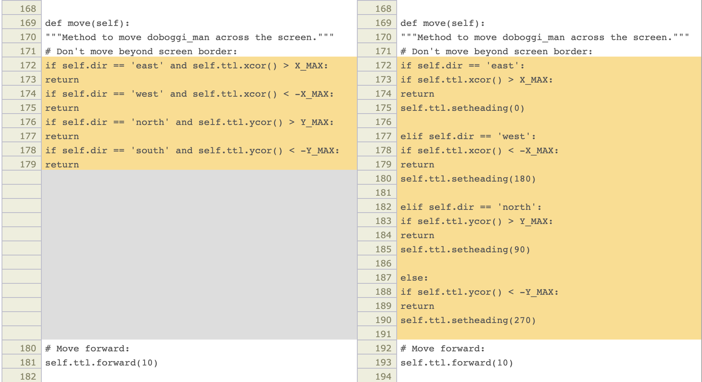
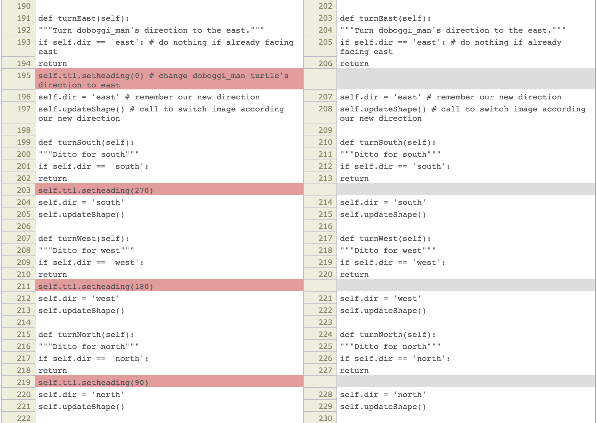

doboggi_man Debugged

Debugged file "character.py" is attached.

 

"doboggi_man" has a minor bug. The direction of doboggi_man goes wrong, if user changes the direction quickly repetitively in too short term(about 4 times per 0.3 sec.)

More deeply, for example, following situation can occur:

 1) The heading of doboggi_man(moving direction) is west.

 2) The direction of img is east.

 3) The right arrow(east) isn't recognized.

 4) The doboggi_man can ignore the side of west. Even it meets left wall, it keeps going and soon disappears.

 5) The disappeared doboggi_man can be come back by controlling arrow keys.

  But east key isn't recognized, so it's required to change the direction into the north or the south first. After that, change into the east.

 6) Please watch the gif file(replayed per about 15 sec.)

This problem is caused because of "character.py".

Line 192~222, character.py.

The methods change the direction of doboggi_man.

The mechanisms of methods are "(1)set turtle heading(movement direction)" → "(2)change direction value" → " update changed direction"

Above bug is from (1)→(2), because (1) and (2) is separated.

With keyboard, user can make the direction is east but heading is west.

So, to debug this, we should not separate (1) and (2).

Left : previous character.py

Right : edited character.py

Technical limit, blank(space) characters are hidden.

Like provided solution, we can unite the setheading() method with move() method.

This can make more processes, but above bug doesn't occurs.

I'm finding more optimized solution.
